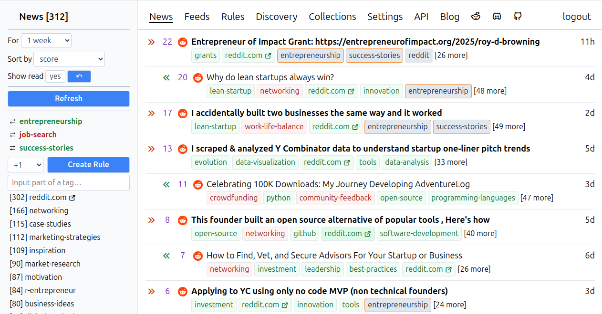

# Feeds Fun

News reader with tags. Self-hosted, if it is your way.

- Reader automatically assigns tags to news.
- You create rules to score news by tags.
- Filter and sort news how you want  ⇒ read only what you want.

Site: [feeds.fun](https://feeds.fun)
Blog: [blog.feeds.fun](https://blog.feeds.fun)

# Screenshots



# Features

- Multi-/single-user.
- Feeds management.
- Automatic tag assignment for every news entry.
- Rules to score news by tags.
- Filter news: exclude news by tags, show only news with tags.
- Sort news by score, date, etc.
- Track news you've read already.
- A lot of other features are comming.

# Motivation

I've subscribed to a lot of news feeds and want to read only the most interesting & important from them.

I did not find an open-source solution that suited my needs => decided to create my own.

# Official site

The last stable version is always available at https://feeds.fun/

It is free to use, and should be stable: no database resets, minimal, downtime, etc.

Just do not forget to set up your OpenAI API key to access the full power of tags generation.

# Self-hosted version

- Backend is accessible as [ffun](https://pypi.org/project/ffun/) package on PyPI.
- Frontend is accessible as [feeds-fun](https://www.npmjs.com/package/feeds-fun) package on NPM.
- Use the latest versions. They should be compatible with each other.

Alternatively, you can install from tags in this repo.

There are no official docker images yet. Feeds Fun will not dictate how to organize your infrastructure. There are too many variants exist of how to prepare and run containers — choose the most suitable for you.

## Configuration

All configs can be redefined via environment variables or `.env` file in the working directory.

You can print actual backend config values with:

```
ffun print-configs
```

The output is not as pretty and ready for copying as it should be, but it will be improved later.

All actual frontend configs can be found [here](site/src/logic/settings.ts).

Format of environment variables:

- For backend: `FFUN_<component>_<option>` or `FFUN_<component>_<option>__<suboption>`.
- For frontend: `VITE_FFUN_<component>_<option>` or `VITE_FFUN_<component>_<option>__<suboption>` — must be set on build time!

For example:

```
FFUN_AUTH_MODE="supertokens"

FFUN_LIBRARIAN_OPENAI_GENERAL_PROCESSOR__ENABLED="True"
```

## Backend

```
pip install ffun

# run DB migrations
ffun migrate

# run API server
uvicorn ffun.application.application:app --host 0.0.0.0 --port 8000 --workers 1

# run workers
ffun workers --librarian --loader
```

The minimal configuration for the backend:

```
# DB connection parameters have default values,
# but it is better to redefine them
FFUN_POSTGRESQL__HOST=...
FFUN_POSTGRESQL__USER=...
FFUN_POSTGRESQL__PASSWORD=...
FFUN_POSTGRESQL__DATABASE=...

FFUN_ENVIRONMENT="prod"

# Required for API server.
FFUN_ENABLE_API="True"

# Set if you want multi-user setup.
FFUN_ENABLE_SUPERTOKENS="True"
FFUN_API_PORT="443"
FFUN_APP_DOMAIN=...
FFUN_APP_PORT="443"
FFUN_AUTH_MODE: "supertokens"
FFUN_AUTH_SUPERTOKENS__COOKIE_SECURE="True"
FFUN_AUTH_SUPERTOKENS__API_KEY=...
FFUN_AUTH_SUPERTOKENS__CONNECTION_URI=...

# Has default value for development environment.
# I strongly recommend to redefine it because of potential security issues.
FFUN_USER_SETTINGS_SECRET_KEY=...

# Enable openai general processor.
# Other processors are enabled by default.
FFUN_LIBRARIAN_OPENAI_GENERAL_PROCESSOR__ENABLED="True"
```

More details see in the architecture section.

## Frontend

If you find this approach too strange, just use tags `frontend-<version>`.

```
npm init -y
npm install feeds-fun
npm install --prefix ./node_modules/feeds-fun

# Set environment variables before next step!!!

# Build static content.
npm run build-only --prefix ./node_modules/feeds-fun

cp -r ./node_modules/feeds-fun/dist ./wherever-you-place-static-content
```

The minimal configuration for the frontend:

```
VITE_FFUN_AUTH_MODE="supertokens" # or "single_user"
VITE_FFUN_APP_DOMAIN=...
VITE_FFUN_APP_PORT=...
```

# Architecture

ASGI application, which you run with `uvicorn` (in the example) provides only HTTP API to access the data and change user-related properties.

All actual work is done by workers, which you run with `ffun workers` command.

## Loader worker

Simply loads & parses feeds.

Can use HTTP proxies, see [configuration options](ffun/ffun/loader/settings.py)

## Librarian worker

Analyse feeds' entries and assign tags to them.

All logic is split into processors. Each processor implements a single approach to produce tags that can be enabled/disabled via configuration.

See configuration options [here](ffun/ffun/librarian/settings.py)

Currently implemented processors:

- `DomainProcessor` — extract domain and subdomains from URL and saves them as tags.
- `NativeTagsProcessor` — save tags that are received with the feed entry.
- `OpenAIGeneralProcessor` — asks OpenAI ChatGPT to detect tags. Currently, it is the most powerful processor. Must-have if you want to use Feed Fun in full power.
- `UpperCaseTitleProcessor` — detect news with uppercase titles and marks them with `upper-case-title` tag.

# Development

## Run

```
git clone git@github.com:Tiendil/feeds.fun.git

cd ./feeds.fun
```

Build some docker images

```
./bin/build-local-containers.sh
```

Start the API server and frontend:

```
docker compose up -d
```

The site will be accessible at http://localhost:5173/

Start workers:

```
./bin/backend-utils.sh poetry run ffun workers --librarian --loader
```

## Utils

List all backend utils:

```
./bin/backend-utils.sh poetry run ffun --help
```

## DB migrations

Apply migrations:

```
./bin/backend-utils.sh poetry run ffun migrate
```

Create new migration:

```
./bin/backend-utils.sh poetry run yoyo new --message "what you want to do" ./ffun/<component>/migrations/
```

Pay attention. There are different directories layouts in the repository and in the docker containers => paths for migrations should be with only a single `ffun` directory.

## Upgrade to new versions

You should always keep versions of the backend and frontend in sync.

Open [CHANGELOG](CHANGELOG.md) and look at which versions require DB migrations. You should upgrade to the first of them, run migrations and only after that upgrade to the next version.

Algorithm:

- Stop services.
- Install the next version.
- Run `ffun migrate`.
- Start services. You can skip this step if you plan to upgrade to the next version immediately.

Also, pay attention to breaking changes and notes in the CHANGELOG.
