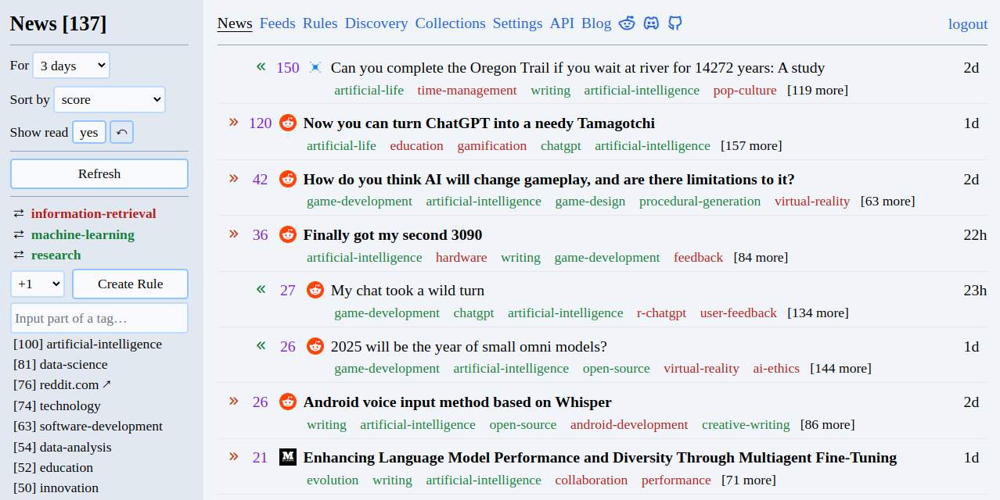

# Feeds Fun — frontend image

News reader with tags & AI. Self-hosted, if it is your way.

- Reader automatically assigns tags to news.
- You create rules to score news by tags.
- Filter and sort news how you want ⇒ read only what you need.

Repository: [github.com/Tiendil/feeds.fun](https://github.com/Tiendil/feeds.fun)

Site: [feeds.fun](https://feeds.fun) with curated collections of feeds that are tagged for free.

Blog: [blog.feeds.fun](https://blog.feeds.fun)

# Screenshots

# Fastest way to try locally

Check instructions in the [docker/examples/single-user](docker/examples/single-user) directory.

# Self-hosted version

Instructions for docker-based installation:

- [single-user setup](docker/examples/single-user)
- [multi-user setup](docker/examples/multi-user)
