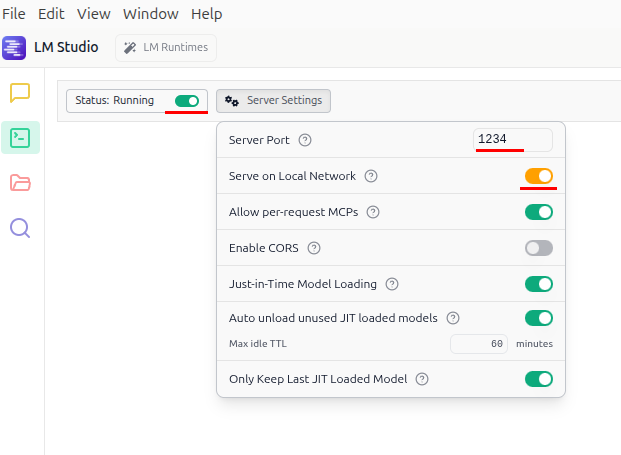

# An example of using third-party LLM models

This example is based on [single-user setup example](docs/examples/single-user) and covers using third-party LLM models for tag processing. Check the original example for more details about single-user setup. This example covers only additional configs required to use third-party LLM models.

You can run this example instance locally using Docker Compose:

```
git clone git@github.com:Tiendil/feeds.fun.git
cd ./feeds.fun/docs/examples/third-party-models

# Configure and run LMStudio before starting Feeds Fun, see instructions below

docker compose up -d
```

Go to `http://localhost/` to access the web interface.

**The comments in the `docker-compose.yml` and other files contain important details.** Those details are not required to run example instances, but we recommend reading (and changing configs accordingly) before running Feeds Fun as a permanent service.

Below you can find some really important notes about running Feeds Fun as a permanent service in a single-user mode.

## Third-party models configuration

To use third-party LLM model you need to configure two things:

1. Set an OpenAI API entry point to the url of the third-party model provider. We'll use [LMStudio](https://lmstudio.ai/), but any should work.
2. Specify your model id in the `tag_processors.toml`
2. Create a custom `models.toml` config with the parameters of used model.

### OpenAI API entry point

We set the following environment variable:

```
FFUN_OPENAI_API_ENTRY_POINT="http://host.docker.internal:1234/v1"
```

This particular configuration tells Feeds Fun to access service you have running locally on your host machine

### Configuring tag processor

We set `model = "mistralai/ministral-3-3b"` for the `llm_general` tag processor. See [tag_processors.toml](./tag_processors.toml) for details.

### Custom models configuration

We add [models.toml](./models.toml) file with the configuration of `mistralai/ministral-3-3b`.

And the `FFUN_LLMS_FRAMEWORK_MODELS_DESCRIPTIONS="/ffun/models.toml"` environment variable to point Feeds Fun to the custom models config file.

### LLMStudio

To run this example you need to download, run and configure [LMStudio](https://lmstudio.ai/). Follow the instructions on their site.

What do you need exactly:

1. Download the `mistralai/ministral-3-3b` model. You can do this via LMStudio.
2. Configure and run LMStudio server on your host machine, binding it to port `1234`. See the screenshot below.
3. Do not forget to load the model into the memory via LMStudio interface.



## If you don't want to process old news

1. Set `allowed_for_users=false` in the `tag_processors.toml`.
2. Wait a bit till the `llm_general` processor skips all old news.
3. Set `allowed_for_users=true` back.
